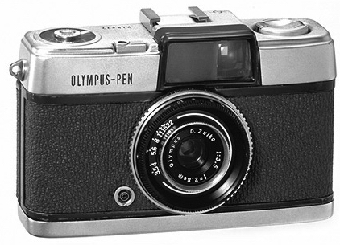

介绍数码相机的工作原理和结构，讲解了单反相机和微单相机的特点、镜头和图像传感器的机制，以及数码相机的各种功能和技术等。内容涉及索尼、佳能和尼康等主流的产品，涵盖数码相机的发展史、取景器、自动对焦、CMOS、影像处理器、防抖、图像存储等大量知识点，帮助理解数码相机的各部件是怎样工作的，以及它们是如何影响画质的，进而提高使用数码相机的水平，拍出技术过硬的好照片。

# 1. 数码相机概要

摄影是一门极具魅力的艺术。相机不仅可以让我们记录眼前的美妙景色，还可以为我们留下美好难忘的回忆。数码相机各式各样，如果能够通过产品说明书或规格表了解到各种相机的优缺点，不仅可以带来更多的乐趣，还可以提高摄影技巧。

## 1.1 数码相机概要和工作原理

### 1.1.1 数码相机各部分名称及作用

> 数码相机的结构是怎样的，它又是怎样拍照的？

以可换镜头式数码相机为例介绍相机的基本工作原理和结构。

可换镜头式数码相机包括 “单镜头反光式数码相机”（单反相机）和 “无反光镜数码相机” （微单相机，旧称无反相机）

单反相机由机身和镜头组成。机身和镜头连接的部位称为**镜头卡口**，只要镜头卡口的规格相匹配，就可以随意切换使用。

### 1.1.2 相机机身的主要部件和功能

单反相机结构的最大特点就是机器内部有**反光镜**和**五棱镜**。这种结构让我们可以通过相机背面的**光学取景器**观察镜头中的成像。

被摄体的光通过镜头后所形成的影像，是通过图像传感器（感光元件）被存储为照片的。因此相机的设计是要将进入镜头的光照射到图像传感器上，但如果不是正在存储图像，那么进入镜头的光也可以通过反光镜和五棱镜被折射到取景器。利用这种结构，拍摄者可以预先通过取景器确认即将拍摄的画面。这是单反相机特有的结构特征。

> 当按下快门时，反光镜升起，镜头中的影像被传送到图像传感器。图像传感器负责将接收的影像发送到影像处理器，以及将影像转换为图片并存储。

其实，胶片时代的单反相机就已经采用这种结构了。所谓“单”，指的是单镜头，即拍摄光路和取景光路共用一个镜头；而“反”指的是“反光镜”，用于在相机内把两个光路分开。

#### 1）反光镜

单反相机机身，从镜头卡口向内部看，就可以看到反光镜。没有拍摄时，光通过反光镜和机身上方的五棱镜进行反射；拍摄时，反光镜升起，光通过位于反光镜后面的快门到达图像传感器。

看不到图像传感器，因为它在反光镜的另一侧。

当反光镜升起时，伴随快门的咔嚓声，机身有微小抖动。

#### 2）五棱镜

五棱镜（屋顶型五棱镜）是安装在相机机身顶部的具有 7 个或 8 个面的棱镜。它通过对反光镜反射的光进行折射，使人们可以从光学取景器看到图像。此外，它具有把上下左右呈颠倒状态的倒立影像翻转过来的作用。

入门级单反相机常用五面镜代替五棱镜，它的性能会影响取景器的视野率和清晰度等。

3 眼点（eye point）指的是能看到取景器内完整画面时，眼睛与取景器的最远距离。

#### 3）机械快门

机械快门具有像窗帘一样的遮光作用，它只在拍摄的瞬间打开，让光传输到图像传感器上。这个拍摄的瞬间就是快门速度或曝光时间。有时需要采用通过长时间打开快门进行长时间曝光的拍摄方法。以机械的方式屏蔽光或控制透光量的机制称为机械快门。数码相机中，还有使用电子快门的系统。

可以设置的最快快门速度因相机机型而异。单反相机，通常能够设置的最快速度为 1/8000 秒。

#### 4）图像传感器（感光元件）

图像传感器是决定图像成像质量最重要的部件之一。虽然根据产品说明书中的参数数值无法判断照片画质的好坏，但通过图像传感器的尺寸、像素数、像素间距这 3 个值，我们可以推测图像传感器的性能。它们的值越大，画质就越高。

> 图像传感器的大小和有效像素数会极大地影响画质。图为EOS 5D Mark Ⅳ 的像素数约 3040 万的 35 mm 全画幅CMOS 图像传感器，这是目前数码单反中最大的图像传感器。

> 尼康的全画幅称为 FX 格式，APS-C 画幅称为 DX 格式。
>
> 有时产品说明书或规格表不会列出像素间距的大小。可以通过图像传感器的水平方向画幅长度 ÷ 水平方向像素数来计算像素间距（例如 D5 机型的分辨率为“5568 × 3712”（L），所以像素间距就是 35.9 ÷5568）。

 D5、D850 和 D810 这 3 款机型的图像传感器都为全画幅。这非常有利于产生高画质。

像素数越多，画质就越精细，同时还要注意查看高像素所导致的像素间距变小有没有产生不好的影响。

除了图像传感器之外，**影像处理器**的性能也会影响画质。因为最终成像是由图像传感器将接收到的光信号转换成图像信息，再由影像处理器处理成照片的，所以图像处理软件的性能对画质也有极大影响。这个影响无法通过规格表中的参数判断。

> 图像传感器会将接收的光信号转换成图像信息，而图像信息最终会被发送到影像处理器中进行处理。影像处理器的性能与最终成像的质量密切相关。上图为 EOS 5D MarkⅣ 的影像处理器，该影像处理器名为 DiGiC 6 +。它采用了最新的降噪处理算法，而且静止图像实现了高达 32 000的 ISO 感光度。影像处理器的处理性能与图像的噪点、ISO 感光度等息息相关。

其实对于画质的高低，需要评估的方面有很多，比如分辨率、对比度、色调、色彩表现、动态范围和弱光拍摄等，所以还是要根据能否在自己最重视的场景中拍出满意的照片来判断。

#### 5）液晶监视器

数码相机在拍好照片后，可以立即通过液晶监视器确认照片。屏幕较大且分辨率较高的液晶监视器更方便确认照片的细节。但是，屏幕越大机身也就越大，电池消耗更快。

### 1.1.3 镜头种类以及各部件的名称和功能

单反相机是一种可以自由更换镜头的相机。可以根据拍摄场景和目的更换相应的镜头。例如：在日常拍摄场景中使用常用的**标准镜头**；在风光摄影等需要广角拍摄的场景中，使用适合广角拍摄的**广角镜头**；而在野生鸟类摄影或体育摄影、室外人像摄影等需要拍摄距离较远的被摄体的场景中，使用**长焦镜头**。

镜头对最终成像的影响也很大，不同的镜头性能不仅会影响快门速度和光圈大小，也会左右自动对焦速度及对焦的准确性。此外，拍摄时的噪点多少（在拍摄视频时尤为重要）、防抖程度（视型号而定）、变焦范围等也会产生影响。

#### 1）xx mm 的镜头

人眼的可视范围称为视野，而相机的可视范围称为视角。长焦镜头虽然可以很清楚地拍到远处的被摄体，但焦距越长视角越窄（小）。而适合拍摄风景的广角镜头，其视角更宽（大）。视角与焦距紧密相关，焦距就是镜头上用 mm 表示的数值，看这个数值就可以知道这是一个什么样的镜头。

> 上图为 80 mm ~ 200 mm 的长焦变焦镜头。长焦镜头可以把距离较远的被摄体拍得又大又清晰。

标准镜头是以人眼的可视范围为基准设计的，焦距为 50 mm 左右。焦距小于它的（例如，40mm 或更小的）称为广角镜头，大于它的（特别是约 80 mm 以上的）称为长焦镜头。然而，也不是说“小于 ×× mm 的就一定是广角镜头”。关于镜头，并没有这么具体的定义。而且随着时代的变迁，各焦距的区间划分也在发生变化。

#### 2）变焦和定焦

可以改变焦距的镜头称为变焦镜头，不能改变焦距的镜头称为定焦镜头。

变焦镜头也有缺点。首先，变焦功能的结构复杂，所以与定焦镜头相比，变焦镜头的镜身更长、更重。可以变焦并同时拥有 F2.8 等大光圈的镜头一般价格比较昂贵。相反，定焦镜头因为结构简单，所以拥有大光圈的还是比较多的。

如果镜头的变焦范围从广角到长焦都可以覆盖，就称这种镜头为高倍率变焦镜头。

> 上图为腾龙 18 mm ~ 400 mm F/3.5-6.3（ModelB028）变焦 镜头。它是世界上第一个实现了在 APS-C 画幅上达到 22.2倍率的超长焦高倍率变焦镜头。

#### 3）镜头卡口

连接相机机身和镜头的部分就是镜头卡口。在单反相机中，人们熟知的有佳能的 EF 卡口、尼康的 F 卡口、索尼的 A 卡口（美能达或柯尼卡美能达 α）和 E 卡口，以及宾得的 KAF2、4/3 系统卡口等。要确保相机和镜头具有兼容性。

## 1.2 数码相机的功能和性能（相机选购要点）

### 1.2.1 单反相机和微单相机

与卡片数码相机有着明显区别的微单相机之所以格外受关注，不仅因为其镜头可换，还因为一些微单相机采用了较大的图像传感器。譬如：微型 4/3 系统的图像传感器大小为 4/3 画幅；索尼 α6500、宾得 K-01 和富士胶片的 FUJIFILM X-Pro1 等的大小为 APS-C 画幅；索尼 α9、α7 系列的大小为 35 mm 全画幅。这些微单相机所用的图像传感器和单反相机的一样。

单镜头的语义与其实际意义有些不同。在相机中，单镜头一般指的是光学取景器的取景光路和曝光光路共用同一镜头。但是，微单相机没有光学取景器，并不符合该定义。

### 1.2.2 理解规格表的内容

决定数码相机画质好坏的因素并不是只有一个。镜头的性能和图像传感器的大小、像素数、动态范围等各种因素都会影响画质。要想比较照片的色调，最好直接确认拍好的照片。也就是说，并不是只要相机配备了具有更高像素的图像传感器，就一定能拍出高画质的照片。

### 1.2.3 数码相机的主要规格

光是“主要规格”就有很多条目，不过这里将以图像传感器、记录媒体、记录图像和镜头等为重点进行介绍（表中标有★）。

> 数码相机的构成部件大致分为图像传感器、镜头、机身、记录媒体等。这里的示例是固定镜头式卡片数码相机的规格，如果是单反相机或微单相机等可换镜头式数码相机，镜头部分的规格可以通过镜头的产品说明书或官方网站确认。

### 1.2.4 有效像素数和图像传感器

能够左右照片画质的部件中，最重要的就是图像传感器。它用于代替胶片将从镜头进入的光记录成像，所以也被称为感光元件。图像传感器的大小（尺寸）和有效像素数是衡量图像传感器性能的两大指标。

现在，常见的数码单反相机所采用的图像传感器，最大尺寸是 35 mm全画幅，接着就是 APS-C 画幅、4/3 画幅。固定镜头的卡片数码相机等也常用英寸表示图像传感器的大小，比较常见的尺寸如图 1.21所示。一般来说，图像传感器越大，出现高光溢出和暗部缺失的机会就越少，色彩表现越好，噪点也越少。

图像传感器被比喻为水桶，光被比喻为水，噪点则被比喻为垃圾。水桶越大，能够储存的水就越多，即使其中混入等量的垃圾，这些垃圾也不会很显眼，所以图像传感器大一些比较好。

图像传感器变大后也会出现一些缺点。例如制造成本变高，耗电量变大，容易发热，相机机身和镜头更大更重等。

虽然像素数越多，成像确实越精细，但在图像传感器大小相同的情况下，像素数越多，摄入的光量就越少，这反而会导致画质下降。

在尼康和佳能的数码单反中，面向专业用户的旗舰机搭载了最大的 35 mm 全画幅图像传感器，但它们的像素数却比其他的 35 mm 全画幅相机还要小（表 1.6）。这表明，包括高感光度摄影在内，如果想拍出高画质的照片，需要找到最合适的像素数，达到高画质和高像素的平衡。

数码相机的图像传感器分为 CMOS 传感器和CCD 两种。二者各有优缺点，但最近采用CMOS 传感器的相机相对较多。CCD 的优点就是噪点少、画质清晰，而 CMOS传感器的特点在于耗电量更小，读取信号的速度更快。但是，由于技术的进步，二者的差距越来越小，所以很难简单说哪种更好。

> CMOS 传感器一般由 2 ~ 3 层基板构造而成（左图）。CCD 一般只有 1 层（右图），而且不需要复杂的金属电路层，结构简单，其特点就是小型图像传感器也可以很容易地得到充足的光。光通过①片上透镜 / 颜色滤镜→②金属电路层→③受光面（光电二极管受光）的路线最终转换成图像。金属电路层②越多（左图），片上透镜①到最终的光电二极管③的距离就越长，所以光信息缺损的可能性就越大，而且这种缺损是图像传感器的体积越小越显著

### 低通滤镜

以往，大部分数码相机的机型会搭载低通滤镜。它一般安装在图像传感器的前面（表面），通过稍微模糊透过镜头的成像来抑制数码图像特有的噪点，即伪色和摩尔纹。在搭载大尺寸图像传感器以实现高分辨率的数码相机上，原本为了抑制噪点而模糊图像的低通滤镜会导致照片分辨率下降，因此不搭载低通滤镜的相机产品诞生了。无低通滤镜的相机能够在远景拍摄等对画质要求较高的拍摄场景中实现高分辨率摄影。

光学可变低通滤镜的相机，通过光学可变低通滤镜，用户可以切换低通滤镜效果。

### 记录媒体

相机的集成内存大小和支持的存储卡类型。

集成内存，就是搭载在数码相机机身内的内存，可以快速读写。用户所拍摄的图片在被保存到读写速度相对较慢的存储卡之前，会先以缓存的形式临时保存到集成内存中。所以，集成内存的容量越大，在高速连拍或持续拍摄模式下能够拍摄的图片张数就会越多。集成内存的大小也会影响查看照片时图片的切换速度。

### 1.2.5 记录图像（记录方式和图像尺寸）

记录方式指的是将图像记录到记录媒体时的文件格式。

除了 JPEG，有些机型还可以把图片保存为 RAW 和 TIFF 格式。RAW也被称为 CCD-RAW，是图像传感器捕捉到图像信号后的原始图像数据。以这种格式保存的图片由于颜色信息丰富，所以容量很大，画质较高，因此数码单反相机和微单相机大多支持这种格式。要查看RAW 格式的图片，需要使用专业的图片浏览软件或 Photoshop 等支持 RAW 格式的软件先将图片转换成 JPEG 或 TIFF 格式，然后才能用于打印或互联网等。

数码单反相机可以在按下快门后，同时保存 JPEG 和 RAW 两种格式的图片文件。如果想尽快确认图片效果，可以使用 JPEG 格式；如果想用于发布或打印，则可先使用支持RAW 格式的图片编辑软件，按照自己的想法对图片的曝光、白平衡等进行后期调整，然后再使用。

TIFF 格式没有很流行。它是一种比 JPEG 画质好，又比 RAW 更加容易操作的图像格式。

 除了上述图片格式，还有 DCF 和 Exif 这两种格式。通过它们，我们可以提高使用数码相机拍摄的图片的兼容性，让图片使用起来更加方便。如果相机支持这些格式，我们就可以在不同数码相机之间共用相同的记录媒体，或者让数码相机直接连接打印机打印图片，还可以方便地在 DPE（Development-Printing-Enlargement，显影 - 印相 - 放大）商店下单打印图片。现在最新的机型大多支持这两种格式。

数码相机大多也支持视频和音频的录制。视频格式有MOV、AVI、WMV、Motion JPEG 和 MPEG 等。

数码相机的文件格式（或容器）通常是 MOV，压缩格式通常是 MPEG-4 AVC/H.264。计算机和互联网上普遍使用 MOV 格式，其特点是兼容性高。

MPEG-4 AVC/H.264 是对视频进行压缩或扩展（录制或播放）的国际标准之一。它具有较高的兼容性，广泛用于智能手机、视频摄像机和高清数字广播设备。

此外，如果对声音有所要求，可以在录制时设置录制声音为立体声（左右）或单声道。

判断相机是否可以拍出好看且分辨率高的照片，可以看相机的最大记录像素数或图像尺寸（表 1.10，图 1.25）。像素越大，拍到的图片就越大。图片的成像质量和图像传感器的大小也密切相关。打印  尺寸分为 L、2L 尺寸的明信片大小，或 A5、B5 和 A4 大小等，如果需要在放大打印照片的同时保证画质，那么就要以较大的图像尺寸保存照片。当然，对于颜色信息丰富的大画幅照片，缩小打印时照片也会更加清晰，我们也可以大胆地剪裁图片。

> 60 f/s 的实际帧速率是 59.94 f/s，30 f/s 是 29.97f/s，24 f/s 是 23.98 f/s。

>  图像尺寸越大，拍到的照片越清晰。像素数越多，拥有的颜色信息越细致，图像的尺寸也会相应变大。有时“像素”也称为“像素点”。关于像素数和画质模式与适用纸尺寸的关系，请参照第 6 章中的表6.2。

“大 (L)”是图像质量最高的模式，最终形成的图像文件会很大。3∶2、16∶9 和 4∶3 等表示可以指定的图像纵横比。

### 1.2.6 镜头

单反相机或微单相机的镜头可以更换，通常与机身分开出售，所以机身的产品说明书或规格表上并不会记载镜头的信息。卡片数码相机大多配备了具有望远功能的变焦镜头，所以对于其镜头性能，人们普遍最在意的是变焦倍率。倍率越大，远处的被摄体就可以拉得越近，远景拍摄效果就越好。

对于变焦倍率，数码相机通常有两种表示方法。一种是与摄像机相同的倍率表示法，即“ ××倍”。另一种就是与胶片相机或可换式镜头产品相同的焦距（视角）表示法，即“ ×× mm”。

使用倍率表示法时，我们虽然能够判断出长焦端的性能，但无法知道在拍摄风景或用广角拍近处的被摄体时，广角端的视野是什么样的。使用焦距表示法时，由于镜头上标注了“广角 ×× mm~长焦 ×× mm”，所以我们可以得知广角端的视野宽度和长焦端的望远距离，进而判断通过改变焦距是否可以拍出想要的照片。

人类的视野接近 50 mm 的焦距范围，在此范围以内的就是广角（可以拍出更加广阔的视野），在此范围之外的就是长焦（可以把远处的物体拍得较大）。焦距范围在 35 mm ~ 75 mm 的一般称为标准变焦。

> 28 mm ~ 70 mm 的 EF 镜头“EF 28-70 mmF/2.88L USM”，属于标准变焦镜头。

变焦分为数码变焦和光学变焦两种。光学变焦即通过改变焦距来实现变焦，与胶片相机的变焦方法一样。数码变焦则是像裁剪图片那样，利用相机内部的处理器，对图片内的部分像素进行“插值”处理，使之变大，从而达到像变焦到长焦端一样放大被摄体的目的，但数码变焦的画质没有光学变焦的清晰。

另外，在判断镜头性能时还有一个参数比较重要，那就是“光圈”。

### 1.2.7 可拍摄范围

被摄体与数码相机之间的距离称为“可拍摄范围”，用 cm 表示。关于拍摄范围，需要注意的是“微距”的性能。微距的可拍摄范围越小，在拍摄花朵、虫子、戒指等较小的物体时，就可以越近地靠近被摄体，将其放入整个画幅之中。

> 标准的自动模式和微距模式都可以使用广角端在距离被摄体 5 cm 时进行拍摄。

### 1.2.8 感光度

感光度又称 ISO 感光度，表示拍摄时对光的灵敏程度。数值越小，表示对光的灵敏度越低，越需要大量的光进行曝光。此时，可以拍出锐度高、噪点少的图片。例如，ISO 100 就非常适合在晴天的室外进行拍摄。相反，ISO 感光度的数值越大，表示对光的灵敏度越高，即使是在室内或夜晚等较暗的场景下，拍摄时也可以不使用闪光灯，但此时拍摄的图片中噪点将变多。

相机的 ISO 感光度越高，越能防止发生抖动。但是，高 ISO 感光度会引发噪点和伪色。在以高 ISO 拍摄时（高感光度拍摄），需要考虑到图像会因噪点而变得粗糙，然后设定一个最佳的快门速度。

在需要采用高感光度拍摄的场景，比如在体育场馆内的比赛、夜晚的演唱会等光量不充足且被摄体经常移动的拍摄场景中，需要尽可能地提高快门速度，防止相机抖动。

如果图像传感器较大，那么即使ISO感光度设置得很高，噪点也不会很明显。此外，也可以通过降低像素来提高聚光能力，这样一来，即便使用超高的感光度拍摄也可以抑制噪点。

### 1.2.9 防抖

失焦或手抖可以说是照片没有拍好的主要原因。防抖是对手持相机拍摄所造成的图像模糊进行自动校正的功能。光学防抖功能分为 “镜片位移式” 和 “图像传感器位移式”（感光元件位移式）。

镜片位移式光学防抖通过检测手的抖动来控制镜头内的校正镜片，从而抵消光轴偏移，完成校正；图像传感器位移式光学防抖则通过调整图像传感器的位置来抵消光轴的偏移。如果是卡片数码相机等固定镜头式数码相机，无须在意配置的是哪一种防抖方式。但如果是单反相机、微单相机等可换镜头式数码相机，最好了解这方面信息，因为防抖功能是在镜头端还是相机端，对挑选镜头也会有影响。

镜片位移式光学防抖又称为镜头防抖。图像传感器位移式光学防抖又称成像防抖或机身防抖。

如果相机是图像传感器位移式光学防抖，不管镜头有没有防抖功能，相机都会进行抖动校正；但如果是镜片位移式光学防抖，那么在使用带防抖功能的镜头拍摄时就会有防抖功能，在使用不带防抖功能的镜头拍摄时就没有防抖功能。

> 奥林巴斯 PEN E-P1 机型搭载的光学防抖功能（IS）单元，用于检测手抖导致的光轴偏移量，并通过移动图像传感器来校正偏差。

>  光学防抖校正（IS）指镜片位移式光学防抖。

### 1.2.10 对焦

自动对焦也就是自动进行合焦的功能，Auto Focus，简称 AF。数码相机使用的自动对焦方式分为 “相位检测自动对焦” （相位检测 AF）和 “反差检测自动对焦”（反差检测 AF）两种。

相位检测自动对焦（Phase Detection AutoFocus，PDAF）也可称为相位对焦，反差检测自动对焦（Contrast Detection Auto Focus，CDAF）也可称为反差对焦或对比度自动对焦、对比检测 AF、对比度 AF 等。

相位检测 AF 是一种可以实现高速合焦的自动对焦方式。在拍照时，要随着合焦的蜂鸣声按下快门——这种流畅的拍照节奏也是单反相机吸引人的魅力之一。反差检测 AF 给人的印象则是要先找到合焦点再进行对焦。如果被摄体的对比度明显，对焦就非常准确。最近也出现了同时支持两种对焦方式的“混合自动对焦”（混合 AF）相机。

要实现相位检测 AF 就必须使用专用的对焦传感器，但最近研发出了可以直接用图像传感器来实现对焦传感器功能的“像面相位检测自动对焦”（像面相位检测 AF）。原本单反相机是不能像摄像机那样动态自动追焦的，“像面相位检测 AF”的出 现有效解决了这个问题。

### 1.2.11 白平衡

白平衡功能用于让白色所成的像依然为白色。也可以说，白平衡功能用于精确还原被摄体的色彩状况，把成像的色调调整为被摄体被正常光源照射时的颜色。在大多数情况下，白平衡处于“自动”状态，但如果了解了它的机制，就可以通过各种设置来控制拍摄时的色调了。

白平衡的模式根据相机的机型而异。一般有自动模式和其他的预设模式（日光 / 阴影 / 阴天 / 钨丝灯 / 白色荧光灯 / 日光荧光灯等）。预设模式越多，能够进行的设置越精确。如果在拍摄时把图片保存为 RAW 格式，还可以在后期使用支持 RAW 格式的编辑软件自由调整白平衡。

> 在拍摄时，白平衡对图像的成像有很大影响。挑选相机时选择预设模式较多的机型比较好。

### 1.2.12 其他

两个重要因素，即取景器和液晶监视器。

通过取景器，我们可以在拍摄前确认被摄体。使用目镜通过镜头直接观察被摄体的取景器称为光学取景器，通过液晶监视器确认被摄体的称为电子取景器。

如果是单反相机，我们可以通过光学取景器来观察和确认实际被摄体（一部分 EVF 专用机型除外）。光学取景器的性能差异体现在取景器视野率、放大倍率和亮度上。如果通过取景器能够确认到全部的拍摄范围，那么视野率就是 100%。专业机型通常能实现 100% 的视野率，但入门机型的视野率大多在 93% ~ 99%。

液晶监视器的屏幕尺寸和分辨率非常重要。屏幕尺寸越大，越便于查看拍好的照片；分辨率越高，看到的图像就越清晰。在此基础上，所拍图像的失焦和高光溢出等问题也更容易确认。

### 1.2.13 大光圈镜头和高价镜头

关于镜头的规格，首先需要注意的就是焦距。要看看镜头是属于广角、标准还是长焦，是变焦还是定焦。此外，高级和中级用户往往比较在意能够衡量镜头性能的光圈大小，即“F 值”。

镜头上的 F 值也被称为“最大光圈”。该数值是当镜头的光圈开放到最大时，也就是入射光最多时的数值。F 值原本是表示拍摄时光圈大小的数值，数值越小光圈越大，但由于不同镜头的最大光圈值也不同，所以现在一般会把该镜头的最大光圈值标注出来。

F 值越小光圈越大，进光量也就越多，表明镜头的性能越好。

## 1.3 数码相机和胶片相机的区别

胶片相机也称为银盐相机。

胶片相机和数码相机在结构上又有什么差异呢？从各自的成像原理来说，数码相机和胶片相机有相似的部分也有不同的部分。相似的是从光进入镜头到保存图像的部分；不同的则是从保存图像到电子显影的部分。为了理解数码相机的基本工作原理，我们需要先通过插图比较一下数码相机和胶片相机之间的差异，了解成像的整个过程。

### 1.3.1 胶片相机：利用胶片的化学变化记录图像

胶片相机中，光通过镜头投射到胶片上，胶片发生化学变化，从而成像。将相机对准被摄体并按下快门按钮时，光进入镜头，使胶片的感光层（含有卤化银粒子和色素的胶片乳剂面）发生化学反应，图像由此显影。对于拍摄好的胶片，要注意不能让它的感光层再次碰到光。在拍摄完成后，需要把胶片从相机里拿出来，送到 DPE 商店进行冲洗。用不了多久，照片就可以冲洗并打印好。

> 在使用胶片相机时，光进入镜头，使胶片产生化学变化，图像由此被记录下来。冲洗胶片并打印后，我们就可以看到实际的照片。

对于胶片中的图像，在冲洗时要先调整颜色和亮度再打印出来。因此，即使是相同的胶片，打印后的照片颜色也会略有不同，有时甚至是完全不同。

### 1.3.2 数码相机：图像传感器捕获图像并显影

直到最终成像为止，数码相机的工作原理与胶片相机都是基本类似的。在数码相机中，光通过镜头折射到图像传感器时，图像传感器会释放电子，接下来信号处理电路会将电子瞬时转换成电信号，然后图像，也就是颜色和形状信息就会以数字信号的形式被记录下来。图像传感器也被称为感光元件，一般有 CCD 和 CMOS 传感器两种。常用于表示数码相机性能的“×× 万像素”指的就是图像传感器的像素数。像素数越多，图像细节的呈现就越精细，所以数码相机的技术难题就在于色彩表现和光圈大小的控制。

此时的数码相机成像被称为 RAW 数据（原始数据），和胶片一样，人眼是看不到这种图像的（不可见图像）。接下来就是数码相机与胶片相机的不同之处了。数码相机会在相机内部对这个不可见图像进行显影，并将其转换成人眼可见的图像，显示在液晶监视器上，或者最终转换成图像文件保存到CF 卡等记录媒体中

> 数码相机不使用胶片，而是使用图像传感器把接收的光转换成电子，进而通过内部的 IC 芯片计算电子的数量并进行数据化。对于这样的数据，需要先在数码相机内部进行显影处理使之可视，然后才可以将其直接转换成图像显示在液晶监视器上。

像这样比较数码相机和胶片相机各自从拍摄到保存图片为止的过程，就可以知道它们的工作原理其实是非常相似的。区别就在于光在经过镜头后是投射到胶片还是图像传感器上。

但是，接下来的处理就有很大差异了。如果是胶片相机，到这里就算完成任务了，但如果是数码相机，接下来就还得继续发光发热。图像传感器把接收的光转换为电子，再转换为电信号，进而由内部的数字信号处理电路瞬时转换成数字信号，存储为图像原始数据（RAW）。接着，还要调整白平衡和清晰度，并进行伽马校正等显影操作，才能将图像原始数据转换成人眼可见的图像。经过处理的图像将被压缩，并被存储到记录媒体中。完成这一系列工序的速度和图像的完美程度可以说也体现了数码相机的性能。

> 整个过程全都在数码相机的内部进行。图像压缩①通常使用不可逆的压缩方式来缩小文件的大小；图像压缩②使用的是可以避免图像劣化的可逆式压缩方式，有时甚至完全不压缩。

另外，如果是使用胶片相机拍的照片，选择的 DPE 商店不同，冲洗出来的照片的色调和对比度就可能不同。同样，在被摄体于数码相机内部被显影和处理为彩色图像的过程中，对色调和对比度的处理也会呈现出各家相机制造商的特点。以前，这个图像化的工序是由数码相机内部搭载的用于进行数字信号处理的 IC 芯片 DSP（Digital Signal Processor，数字信号处理器）完成的。但是，最近图像的大小越来越大，而且人们又希望获得越来越快的连拍速度，实现更高级的色彩表现，所以各制造商就开发了拥有自主知识产权的数码相机专用 IC 芯片，并将其搭载于数码相机上。这种 IC 芯片也被称为影像处理器，比较知名的有佳能的 DIGIC、索尼的 Bionz、尼康的 EXPEED、松下的维纳斯、宾得的 PRIME、卡西欧的 EXILIM 和富士胶片的高速实时图像处理引擎等。

## 1.4 数码相机的发展史

### 1.4.1 马维卡相机和静态视频相机

第一台抛弃了感光胶片，开始使用**内存或磁盘**记录图片的数码相机是索尼的**马维卡**（MAVICA）相机。1981.

佳能可换镜头的单镜头反光式相机**佳能 RC-701**，这也是第一款商用的静态视频相机。1986.

当时的静态视频相机是以摄像机的方式记录图片的。简单地说，就是通过从视频文件中提取出 1 帧的方式记录图片。众所周知，在 NTSC 制式的摄像机中，共有 525 条扫描线，显示完整的一帧需要扫描 2 次。第 1 次粗略显示的扫描面称为“图场”，第 2 次用于填补其余部分的扫描面称为“影格”。RC-701 搭载了水平方向 780 像素的CCD，一张软盘上可以记录 50 张图片的图场，同时拥有在 1 秒内拍摄多达 10 张照片的高速连拍功能。

### 1.4.2 全数码相机的诞生

以马维卡（MAVICA）为开端的静态视频相机虽然是以软盘作为记录媒体的，但图像的记录是用模拟方式进行的，因此也称之为“模拟电子照相机”等。

首台使用数字方式记录图像的数码相机是 1988 年富士胶片发售的 FUJIX DS-1P。它记录图像的方式为采用 CCD 接收从镜头进入的光，将光信号转换成电信号、数字信号，然后转换为数字数据并存储到存储卡上。这款相机从生成图像到保存图像的工作原理与现在的数码相机基本相同，图像记录方式也是数字的，真正实现了全数字化。

FUJIX DS-1P 所用的 SRAM 存储卡在保存图片时需要由电源或电池供电。如果电池突然没电了，那么已经拍摄的图片就会跟着一起消失。因此，亟待开发一种像现在的 CF 卡或内存卡这样无须担心电池，可以随身携带的记录媒体。

第一台采用无须电池支持的闪存卡的数码相机是 1993 年的 FUJIX DS-200F。DS-200F 搭载了 2 MB 的闪存，最多能记录约 40帧的数字图片，其中还内置了双焦点镜头和播放功能。

卡西欧 1995 年发布的 QV-10 是第一台在画质和价格上都可以让普通用户轻松接受的数码相机产品。

与此同时，佳能在面向专业用户的高端数码单反相机市场推出了冠名 EOS 的 EOS DCS 3。

同年，为了与卡西欧的 QV-10 对抗，富士胶片发售了世界上第一台搭载 SM（Smart Media）存储卡的数码相机 CLIP-IT DS-7

同年 7 月佳能发布了拥有 57 万像素的高画质机型PowerShot 600。

自此，数码相机行业开始进入高像素 CCD 急速发展的阶段。同年 10月，奥林巴斯（当时公司名为奥林巴斯光学工业）的数码相机以“高像素和高画质”为卖点展开攻势。其发布的 CAMEDIA C-800L 机型搭载了 81万像素的 CCD，像素远超PowerShot 600 的 57 万。

当时的数码相机虽说画质有所提高，但与胶片相机相比，还是相形见绌，因此人们当时除了使用数码相机拍照，还用它来做记录。比如，用它代替扫描仪拍下杂志或报纸的页面以便保存，或者拍下车站的时刻表或做的笔记等，然后导入计算机或电子邮件中使用。

在这之后，数码相机开始进入百万像素时代。

### 1.4.3 高画质的百万像素时代

97年奥林巴斯发布了一款高画质数码相机，即变焦式固定镜头数码单反相机 CAMEDIA C-1400L。

> 它搭载了大光圈镜头和 3/2 英寸的大画幅 CCD 图像传感器，其高清画质吸引了很多摄影爱好者。虽然机身略大，但采用的L 型设计由于握持感很好而广受好评。

与此同时，柯达推出了 DC210 ZOOM。它采用了操作感和画质都广受好评的 109 万方形像素原色CCD。

1998 年，富士胶片发布了竖式薄机身的 FinePix700 —— CCD 像素数高达 150 万的高画质单元搭载在尺寸为宽 80 mm × 高 101 mm ×厚 33 mm、重量仅 245 g 的轻薄机身中。在百万像素级相机中，它是当时世界上最小、最轻量的。此外，这台相机还搭载了两个 RISC-CPU，可以高效处理高分辨率的大尺寸图片，从信号处理到保存至存储卡只需大约 5 秒，时间缩短了一半。FinePix700 兼顾了便携性和高画质，因而深受欢迎。

### 1.4.4 蜂窝状排列的 CCD 问世

哪些要素可以让相机实现高画质呢？

答案并不唯一。为了使拍摄的画面更加精细，各制造商纷纷开始追求高分辨率。数码相机使用 CCD、CMOS 等图像传感器取代胶片，用它们接收光并生成图像。缩小每个图像传感器的像素点上搭载的光电二极管，大量凝缩，就可以更加轻松地实现高分辨率的画质。随着像素数的提高，拍出的照片的画质也更高，吸引了很多用户购买。最终，各制造商开始了高像素竞赛。

人们又发现了另一个问题。光电二极管上必须设计电路或信号传送路径，但如果布局紧密，那么由于空间大小受限，在相同大小的图像传感器上，像素数越多受光面积就越小。如果受光面积变小，就很难充分地聚集光，感光度和色彩再现幅度也会随之变小。动态范围变小，就意味着容易产生高光溢出和暗部缺失。所以，虽然像素数越多分辨率越高，但此时会引发画质下降的问题。

解决办法之一是尽可能地扩大光电二极管的面积。于是，“蜂窝状排列超级 CCD”应运而生。

> 开发了采用蜂窝状排列的图像传感器，发布了由具有更高感光度的 S 像素和更宽动态范围的 R 像素组成的超级 CCD SR。

### 1.4.5 高倍率变焦市场

00年，为了开拓高倍率变焦相机市场，奥林巴斯开发了 CAMEDIA C-2100 Ultra Zoom。它搭载了防抖功能和从 F2.8 到 F3.5 的大光圈 10 倍变焦镜头（进行 35 mm 规格换算后焦距为 38 mm ~ 380 mm）。

由于采用了高倍率变焦，总像素数为 211 万的1/2 英寸CCD 的高画质受到了广泛关注。

次年 3 月发布了满足上述需求的CAMEDIA C-700 UltraZoom。

02年高倍率变焦相机的市场迎来巨大的变化。松下发布了第一台具有 12 倍光学变焦的 LUMIX DMC-FZ1 数码相机。

松下采用独有的光学防抖功能抑制了采用高倍率变焦镜头时的手抖问题。 相机内部的陀螺仪传感器检测到手的抖动时，就通过移动镜片对图像进行修复——这就是MEGA OIS 的防抖机制。

随着高倍率变焦相机的技术成熟，奥林巴斯于2008 年 2 月发布了一款搭载 20 倍光学变焦镜头的卡片数码相机 CAMEDIA SP-570UZ（图1.51）。进行 35 mm 规格换算后，它的焦距范围可以达到 26 mm（广角端）~ 520 mm（超长焦）。这款相机还搭载了图像传感器（CCD）位移式和高感光度拍摄两种防抖方式。

### 1.4.6 高性能与轻薄型卡片数码相机

其实数码相机一直在追求更简单的操作和更高的画质，以实现与手机的差异化。

2008 年索尼发布了 Cyber-shot DSC-T77。这是一款轻薄和高性能两全其美的产品，搭载了像素数为 1010 万的 CCD、4倍光学变焦镜头、光学防抖功能，实现了世界最薄的 13.9 mm 机身。内置镜头片组自带新开发的防抖功能，与相机机身厚度大致相同，最大程度地实现了轻薄化。变焦结构是垂直设置的，CCD 配置在了变焦结构单元的底部。

### 1.4.7 高级卡片数码相机的出现

大部分智能手机拥有了与卡片数码相机不相上下的画质，而且通过下载丰富的应用程序，用户不仅可以在拍摄时自由挑选与场景相适应的拍摄模式，还可以在拍摄完成后直接用手机内的修图软件调整照片的颜色和亮度，或进行加工和裁剪等，使照片更加好看。

高级卡片数码相机开始受到关注。因为这类相机追求的是实现智能手机无法实现的高画质和手动摄影模式等，让人们体验到与单反相机同样的拍摄乐趣，轻松实现高画质拍摄。

高级卡片数码相机最初的定位是“搭载 F2.0 以下的大光圈镜头，不仅有全自动拍摄模式，还有快门优先、光圈优先和手动拍摄等模式”的产品，目标用户是有一定摄影技术的爱好者。当时的相机市场仍以价格略高一些的卡片数码相机为主，比如适马的 DP Merrill 系列、理光的 GR、尼康的 COOLPIX A，以及富士胶片的 X100 和X100S 等，它们都是搭载了与单反相机同样的APS-C 画幅图像传感器的机型。

以富士胶片在 2013 年 2 月发售的胶片相机X100S 为例来说，它不仅搭载了大尺寸图像传感器，而且去掉了低通滤镜，以求拍出更高分辨率的图片。另外，它在图像传感器中嵌入了单反相机上使用的相位检测 AF 传感器，并采用了卡片数码相机上使用的反差检测AF 和混合 AF，使自动对焦速度最快达到了0.08 秒。机身设计仿照了以前的旁轴相机，而且取景器的设计也相当有特色：采用了混合式设计，可自由切换光学取景器和电子取景器，在拍摄移动物体等需要更加重视快门速度的被摄体时，就可以切换为无延迟的光学取景器。光学变焦倍率（广角 / 标准）和图像尺寸（多阶段）还可以根据安装的镜头自动变化。

2012 年 11 月，搭载 35 mm 全画幅图像传感器的卡片数码相机终于出现了，那就是索尼的RX1（无低通滤镜版为 RX1 R）。它虽然是固定镜头式相机，但搭载了与单反相机 α99 相同的 2430 万像素 35 mm 全画幅图像传感器。镜头采用了定焦 35 mm、F2.0 的卡尔蔡司 Zoner T*。

这些配备了大尺寸图像传感器的高级卡片数码相机搭载的大多是定焦镜头而不是变焦镜头，这也是其产品特点。可见，相比便利性，高级卡片数码相机更注重镜头性能和拍摄性能。在机身设计上，高级卡片数码相机大多摒弃了卡片数码相机以前经常采用的扁平状轻薄型小机身，转而强调质感，采用铝或镁合金作为材料。另外还可以看到很多机型采用了类似于胶片相机的设计，容易勾起怀旧感，让人感到拥有它本身就是一种乐趣。

不过，从既想要随身携带又追求高画质的用户需求来说，高级卡片数码相机和微单相机的市场有一定重合。只是对于那些不想折腾着换镜头的用户来说，固定镜头且整体性能更高的高级卡片数码相机可能更有竞争力。可换镜头的微单相机和固定镜头的高级卡片数码相机今后将会如何竞争、共存和发展呢？让我们拭目以待。

### 1.4.8 大众型数码单反相机

佳能从 1995 年开始发售 EOS DCS 3 和 EOSDCS 1，打开了面向专业用户的高级数码单反相机市场，但 EOS 系列的价格区间一直保持在约合人民币 125 740元~ 251 480 元的高价位。直到 1999 年，尼康发售了 D1，众多专业用户才感到可换镜头式数码单反相机的价位可以接受。当时，D1 机身建议零售价为约合人民币40 865 元。

专业用户不仅对画质有要求，而且对操作性、连拍速度、快速写入能力、对各种相关设备的兼容性、拍摄信息和直方图显示等也有要求。到了2001 年，尼康把 D1 分成了两个产品线。其中一个是 D1H，它采用了与 D1 大致相同的规格，但提高了操作性，降低了销售价格（当时机身的建议零售价为约合人民币29 548 元）。

另外一个是 D1X，有效像素数提高到了 533 万（当时机身的建议零售价约合人民币 37 093 元）。它受到了很多专业摄影师的追捧。

佳能 D30 第一次在高级数码单反相机的图像传感器上采用了自主研发的 CMOS 传感器。此前的 CMOS 传感器被指存在画质降低等各种缺点，不过，随着 CMOS 传感器的优点逐渐被大家理解，现在在数码单反相机上搭载 CMOS 传感器已经成为主流。

2003 年，佳能发布了 EOS KissDigital，它使数码单反相机市场发生了巨大的变化。数码单反相机的消费市场一直以来都以专业人士和部分摄影爱好者为中心，但当机身的定价只有不到约合人民币 7544 元的 EOS Kiss Digital 一出现，很多只为休闲娱乐而使用胶片单反相机的普通用户也纷纷购买，形成了很大的市场。

EOS Kiss Digital 还准备了相机套机，搭配的是为数码相机专门研发的 EF-S 变焦镜头。这个组合不论是谁，在购买后都可以立即上手使用。因此，EOS Kiss Digital 取得了全球市场份额第一名的成绩。

尼康也于 2004 年推出了可以使用现有 AF尼克尔镜头的大众型数码单反相机 D70。

### 1.4.9 4/3 系统规格的登场

2003 年奥林巴斯发布了数码单反相机 E-1。E-1 是首次采用数码单反相机新标准 4/3 系统（Four Thirds System）的可换镜头式数码单反相机。

4/3 系统规格是由奥林巴斯和柯达共同制定的针对可换镜头式数码单反相机的全新规格。该规格规定图像传感器的大小为 4/3 英寸，为数码相机提供了全新的最佳生态。

在 4/3 系统中，镜头和机身的挂载都是开放性标准，只要是支持该系统的相机或镜头，就一定可以兼容。针对佳能和尼康的相机产品能够使用从前胶片相机上使用的丰富镜头群这一点，4/3 系统提出了这样的思想：与其使用旧资源，不如使用专为新的数码相机时代设计的完美镜头，使镜头和机身的组合成为一种新的标准。

35 mm 胶片原本用于拍摄电影，经过了漫长的岁月，这个胶片尺寸才成为一种标准，人们以它为基准设计了相机的机身和镜头，数码单反相机也继承了那个时代的设计。因此，正如 4/3 系统所提倡的那样，如果将相当于胶片替代品的图像传感器的尺寸规定为小于 35 mm，并以此为基准设计机身和镜头，那么从理论上来说，机身和镜头是可以缩小的。比如，因为 4/3 系统的 35 mm 等效焦距转换率为2 倍，所以一个 300 mm 焦距的镜头装在 4/3系统的相机上，可以等效于一个 600 mm的镜头装在 35 mm 全画幅胶片相机上。

> 按照 4/3、APS 和 35 mm 画幅比较镜头大小的示意图。要想保持相同的焦距，那么 4/3 系统的长焦镜头只需要35 mm 规格下的一半长度即可。

如果是相同焦距的镜头，镜头的尺寸应该可以更小，价格也可以更便宜。

另外，图像传感器的结构特点导致数码相机与胶片相机不同，需要让图像传感器直接接收从镜头射入的光。数码相机所用的镜头设计也考虑了这一点。

### 1.4.10 微单相机的普及

数码单反相机的机身和镜头对于女性用户来说还是太大了，同时也有不少人提出想要一台携带更加方便的小型高性能相机作为备用机。但是，要想做到更加小巧、更加轻量，有两个方面的问题需要解决。

第一个问题是，为了使胶片相机时代的镜头在数码单反相机上也可以使用，从镜头卡口到图像传感器的距离，也就是法兰距，必须与以前胶片相机上的相应距离保持一致。为此，从相机结构设计上来说，不能大幅缩小相机机身的大小（关于法兰距，详见 3.14 节）。

第二个问题正如前面所说，单反相机的结构非常复杂，它有一个反光镜箱，光需要经过反光镜和五棱镜的反射才能到达光学取景器。这也是阻碍机身缩小的一个重要因素。

此时，刚才讲到的 4/3 系统起到了很大作用。奥林巴斯积极地制造支持 4/3 系统的单反相机，并实现了相机的小型化，也得到了市场的好评，但即便如此，第二个问题也仍然没有得到彻底解决。

此时登场的是微型 4/3 系统规格。在 2008 年 8月公布的该扩展规格中，镜头卡口口径变小，法兰距也被缩短到原先的约 1/2。最重要的是，该系统取消了反光镜或五棱镜，引入了光路直接达到图像传感器的结构，从而实现了相机机身的轻薄化和小型化。于是，不搭载反光镜的微单相机诞生了。

由于没有反光镜结构，所以机身背面没有光学取景器。取而代之的是电子取景器，即与卡片数码相机一样，在液晶监视器上输出影像（在单反相机中，这被称为实时取景）。

微单相机的目标客户一开始是对购买单反相机有些犹豫的用户，以及认为单反相机体积太大的女性用户。2008 年，松下发布了 LumixDMC-G1。

09年，奥林巴斯发布了第一台支持微型4/3 系统的微单相机“奥林巴斯 PEN E-P1”。

在奥林巴斯 PEN 系列问世 50 年后的2009 年，它以数码相机的形式复活了——这就是微单相机 E-P1。

微单相机兼具可换镜头式相机的拍摄乐趣和小巧轻便的握持感，因而一下子受到了人们的关注，成为热门话题。虽然微型 4/3 系统是由加盟制造商制定的统一标准，但其他制造商仍然陆续发布了拥有自己标准的微单相机。

其中，索尼的 α NEX 系列进一步奠定了微单相机的地位。2010 年 6月索尼发售了可换镜头式数码相机 NEX-5，其机身是当时世界上最小最轻量的，上面搭载了比微型 4/3 系统采用的图像传感器还大的 APS-C 画幅 CMOS 传感器Exmor（像素数为 1420 万），画幅与单反相机中最常用的图像传感器相同。

一般来说，图像传感器尺寸越大，背景虚化的表现能力就越强，动态范围也越广，不容易出现高光溢出和暗部缺失等。

α NEX 的镜头卡口使用了新开发的 E 卡口，但索尼的老用户拥有很多 A 卡口（旧柯尼卡美能达）的镜头，为了方便这些用户在微单相机上继续使用原有镜头，索尼又另外发售了卡口转接环。只要加上转接环，就可以在微单相机上安装A 卡口镜头并使用。

如果算上胶片相机时代，单反相机的历史很长，再加上高性能镜头价格昂贵，所以单反相机用户即使换了相机，也很希望能够把以前购买的镜头用在新的相机上。为了满足这样的需求，相机制造商开发了镜头转接环，以便将单反相机的镜头安装在微单相机上使用。

尼康于 2011 年发布了 Nikon 1（V1/J1），正式进入微单相机市场。当时，尼康称之为“可换镜头式高级相机”。Nikon 1（V1/ J1）采用了比 APS-C和 4/3 系统更小的 1 英寸（13.2 mm × 8.8mm）图像传感器。由于采用的图像传感器较小，所以专为新开发的 Nikon 1 卡口设计的镜头也比较小巧。另外，尼康还准备了卡口转接环，方便老用户在 Nikon 1（V1/J1）上使用单反相机的 F 卡口镜头。

尼康在该产品上进行了革新尝试，新增了混合AF 功能。混合 AF 技术混合使用了单反相机的相位检测 AF 技术和微单相机或卡片数码相机中常用的反差检测 AF 技术。这款相机拥有高速的对焦速度（合焦速度）、最快10 帧 / 秒的连拍（中央固定自动对焦时），以及按下快门后最高 20 次连拍并存储 5 张最佳照片等功能，其拍摄功能也得到了单反相机用户的好评。

在主要的相机制造商中，佳能是较晚进入微单相机市场的。它在 2012 年发售的 EOS M 搭载了有效像素数为 1800 万的 APS-C 画幅CMOS 传感器。为了实现高速自动对焦，图像传感器的中央部位还搭载了相位检测AF 传感器（混合 AF）。佳能还新设计了 EF-M镜头卡口，发布了小型的 22 mm 定焦饼干镜头和标准变焦镜头 EF-M 18-55 mm F3.5-5.6 ISSTM。

佳能拥有从胶片相机时代就存在的 EF 镜头以及数码相机专用的 EF-S镜头，无论哪种镜头都可以通过转接环挂载到 EOS M 上。机身颜色有黑色、银色、白色、红色可以选择。

> 挂载了单反相机专用的大口径 EF 镜头 EF 70-200 mmF2.8 L IS Ⅱ USM 的微单相机 EOS M。看上去不太协调，但还是相当震撼的。

### 1.4.11 全画幅图像传感器机型初露锋芒

左右数码相机画质的最大因素是图像传感器（感光元件）的性能。一般来说，图像传感器越大、越容易拍出漂亮的照片。同时，图像传感器越大，背景虚化效果越明显，所以在人像摄影和微距摄影等需要拍出浅景深照片的拍摄场景中，图像传感器的性能差异比较明显。

数码单反相机的图像传感器主要使用如下 3 种画幅。

> 35 mm 全画幅（左）和 APS-C 画幅（右）图像传感器。全画幅的面积是 APS-C 画幅的 2.2 ~ 2.4 倍。

35 mm 全画幅是因图像传感器大小与胶片相机时代通常使用的 35 mm 胶片大小相同而得名的。一般的大众型胶片式单反相机采用的是 35mm胶片（24 mm × 36 mm），所以镜头也是按照这个规格设计的。从数码相机的结构来说，图像传感器替代了 35 mm 胶片，所以按 35mm 胶片设计的镜头可以直接在搭载图像传感器的相机上使用。

APS-C 可以说是数码相机的标准画幅，其因画幅大小与胶片相机后期流行的盒式胶片 APS-C（C 型）大致相同而得名（除此之外，也有尺寸稍大的 APS-H 画幅）。

不过，关于全画幅和 APS-C 画幅，由于根据制造商或机型的不同，图像传感器的长和宽也不尽相同，所以具体的大小并没有完全规范化或统一化。另外，对于不同画幅，尼康有单独的称呼，全画幅称为 FX 格式，APS-C 画幅称为 DX 格式。

> 即使是同一家制造商，机型不同，图像传感器的大小也不同。
>
> 4/3 系统则如前所述，是以奥林巴斯和柯达为中心制定的数码相机专用规格。4/3 系统图像传感器的大小是 4/3 英寸，约为 17.3 mm × 13mm，比 APS-C 画幅的尺寸小。

在数码相机市场上，搭载 APS-C 画幅图像传感器的相机能够成为主流是有原因的。

一般来说，图像传感器越大，产品制造的成品率就越低，成本就越高。与 APS-C 画幅相比，全画幅的面积比增大了 2 倍以上，而且从镜头进入的图像的成像圈也需要使用全画幅。此外，在需要长时间使用图像传感器的情况下，比如使用实时取景或短片拍摄等拍摄手法时，图像传感器越大，耗电量越大，越容易发热，对此也需要采取应对措施。基于这些原因，全画幅数码单反相机的机身很大，价格也很昂贵。在数码单反相机普及时期，全画幅相机大多是售价约合人民币 31 435 元以上的高价产品，所以购买的用户要么是专业摄影师，要么是部分摄影爱好者（关于图像传感器和成像圈，详见4.2 节）。

单反相机如果搭载尺寸比全画幅小的 APS-C 画幅图像传感器，就可以拥有更加紧凑小巧的机身，价格也会更加便宜。一旦量产，成本会进一步降低，因此在入门机型和中端机型中 APS-C画幅逐渐成为主流。

但是，APS-C 画幅的机型也有不方便的地方。如果在 APS-C 画幅单反相机上使用 35 mm 胶片规格相机镜头，真实焦距其实是标示焦距的1.5 ~ 1.6 倍。例如，如果将 80 mm ~ 200mm的变焦镜头安装在佳能 APS-C 画幅的机型上，焦距就会变为 126 mm ~ 320mm（佳能的真实  焦距是标示焦距的 1.6 倍，尼康则是 1.5 倍）。这就是 35 mm 规格换算。对于经常使用长焦端拍摄的用户来说，以往当作 200 mm 使用的镜头变成 320 mm 的镜头（即长焦端焦距变长）当然是很开心的，但对于经常使用广角端拍摄的用户来说，可能就需要更换别的镜头才行。而且，如果最看重画质，图像面积大得多的全画幅机型才是处于绝对有利地位的相机。因此，数码相机市场亟待一款摄影爱好者更愿意购买的全画幅机型。

> 全画幅机型的优点，搭载了 35 mm 全画幅图像传感器的相机一般有如下优点。
>
> - 可以获得动态范围更宽的画质（图像更少出现高光溢出或暗部缺失）
> - 更加擅长高感光度拍摄（即使提高 ISO 感光度，噪点也很少）
> - 更容易拍出背景虚化效果好的照片（可以拍出浅景深的照片）
> - 镜头焦距不变（无须以 35 mm 规格换算；广角镜头可以直接使用）

> 2007 年尼康发布了 D3，采用的是自家开发的有效像素 1210 万的全画幅 CMOS 传感器（FX 格式的名称也是在此时发布的）。D3 还搭载了实时取景功能，销售价是约合人民币 34 578 元~ 37722 元。

> 2008 年索尼发布了 α900（DSLR-A900），采用的是索尼自己成功开发并制造的有效像素 2481 万的全画幅 CMOS 传感器，机身内置防抖功能。

> 从一开始就致力于开发全画幅图像传感器的佳能发布了中端机型 EOS 5D 系列。

尼康产品阵容丰富，入门机型和中端机型有 5 款APS-C 画幅产品，介于中端机型和高端机型之间的有全画幅的 D610 和 D750，中端机型、高端机型和专业机型有 5 款全画幅产品。

中端机型采用的是五棱镜，而入门级的 APS-C画幅机型有些采用的还是五面镜。不仅如此，中端机型与入门机型在使用光学取景器观察时的亮度、视野率等方面也有差异。

另外，比较 D3400 与 D5300 和 D5600 的图像传感器，可以看出它们的定位比较接近。D5300和 D5600 的特点在于对焦点多，搭载了可翻转液晶监视器，支持 Wi-Fi（无线局域网）等。

产品阵容丰富的优点在于用户可以自由选择，但在这种情况下，用户也有可能因为不知道哪台相机更加适合自己而感到苦恼。

### 1.4.12 全画幅微单相机初露锋芒——解读索尼产品阵容

2013 年，索尼推出了世界上第一台搭载全画幅图像传感器的微单相机。与单反相机相比，机身非常小巧轻量是它的特点。自此，索尼确立了利用这一特点及索尼独有的技术能力开发高画质全画幅微单相机的发展路线。

下图是从 2017 年 9 月索尼全画幅微单相机的最新产品阵容中挑选的 4 款机型。了解这个产品阵容，有助于大家学习如何选择数码相机。目前最新信息请访问索尼官方网站获取。

索尼并没有定位为旗舰机的机型。这里我们就先以购买的容易程度为标准，假定 α7 Ⅱ为标准机型，在此基础上尝试解读索尼的产品阵容。

α7 Ⅱ的售价约合人民币 10366 元，搭载了约 2430万像素的图像传感器。相位检测 AF 传感器的对焦点数量为 117个。对焦点越多，画框内可以实现自动对焦的范围就越大。最大连拍速度为每秒 5 帧。也就是说，每秒可以连拍 5 张照片，在拍摄体育赛事、代步工具或宠物等时，往往需要抓拍运动的被摄体，所以需要使用连拍。这里列出的所有机型都搭载了 5 轴防抖功能、有机 EL 电子取景器（液晶屏类型）、翻转液晶屏（能改变液晶屏的角度）和 Wi-Fi 功能等。

α7R Ⅱ是高画质机型，名称中的 R 是分辨率的英文 Resoluson 的首字母。它搭载了约 4240万像素的图像传感器，即使与其他制造商的单反相机相比，像素数也算是高的。像素高就可以使画面的表现更加精细。相位检测 AF 传感器的对焦点为 399 个，售价约合人民币 22 562 元，价格是 α7 Ⅱ的 2 倍以上。

但是，细节表现能力只是形成高画质的一大因素。除此之外，色彩纯度、色彩深度、动态范围和色彩平衡等也是评价画质时的重点考虑因素。判断标准也因人而异。这款机型细节表现精细，可以说是对高画质很有追求的一款机型。

α7S Ⅱ搭载的则是 1220 万像素的图像传感器，像素数比 α7 Ⅱ低。这是为什么呢？原因就在于ISO 感光度的差异。α7S Ⅱ的最大 ISO 感光度为 102 400，与 α7 Ⅱ的 25 600 相比差异巨大。这表示 α7S Ⅱ即使在比较暗的暗光环境下也可以拍出噪点较少的图片。因此，可以推测出它并没有把感光像素点紧密排列在图像传感器中，而是保持了较宽的间距，或者影像处理器对噪点进行了相关的调整。这个功能正是需要在暗处以较快的快门速度进行拍摄的新闻摄影和体育现场摄影等所渴求的，演唱会摄影等也需要这种功能。

α9 是搭载了新开发的集成内存式 35 mm 全画幅堆栈式 CMOS 图像传感器的机型。集成内存使得最高连拍速度达到了惊人的每秒 20 帧。相位检测 AF 的对焦点为 693 个，大大提高了对焦准确度。图像传感器的像素数为 2420 万，从画质可以看出，它在图像像素和色彩平衡上都有很大提升。

这里介绍的只是可以从以上 4 款机型中发现的特征中的几个，其实每个机型还有更多的优点和特点。不过，仅从这些信息也可以看出各大制造商在产品阵容布局上的意图。本书目的之一就是让大家能够像这样独立解读相机的产品说明书和规格表。

### 1.4.13 搭载 GPS 且具备通信功能的数码相机

在旅游景点，手持卡片数码相机拍照的人越来越少，使用手机拍照的人越来越多。原因在于人们一般会随身携带手机，而且现在手机的拍照性能也得到了较大改善，有些甚至带有 GPS 功能，可以记录拍照地点信息。此外，拍好照片后可以直接上传到社交软件上与大家分享，这种通信功能也非常重要。希望把拍摄的照片立刻上传到社交软件上和朋友分享的用户居多，因此对于数码相机来说，附带这种功能就显得尤为重要。在此背景下，越来越多的微单相机或单反相机开始搭载 GPS 定位功能，以及可以与智能手机、计算机和互联网等通信的 Wi-Fi 功能，只要靠近手机就可以通信的NFC 功能等。

> 佳能的 EOS 6D Mark Ⅱ 是搭载了全画幅图像传感器及可旋转液晶监视器的世界最轻量的单反相机。它虽然是全画幅单反相机，但也具备 GPS 功能、无线局域网功能、蓝牙和 NFC 等丰富的通信功能，兼顾了高画质和照片使用的便利性。除了美国的 GPS 卫星和俄罗斯的格洛纳斯（GLONASS）卫星，它还支持日本的准天顶卫星 MICHIBIKI。Wi-Fi 支持的是 IEEE 802.11b/g/n 标准。

> 佳能的 EOS 5D Mark Ⅳ 也具备 GPS、Wi-Fi 和 NFC 功能。GPS 和 Wi-Fi 的单元模块安装在机身顶部的五棱镜周围，NFC 单元安装在机身右侧。

